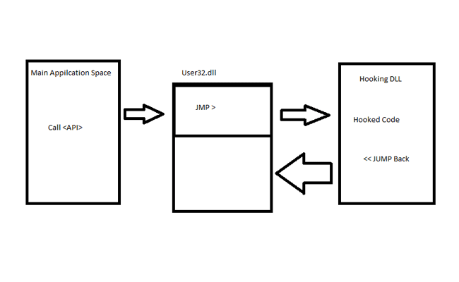

# what's API Hooking
* API Hooking is a technique by which we can instrument and modify the behavior and flow of API calls. API hooking can be done using various methods on Windows. Techniques include memory break point and . DEP and JMP instruction insertion.

